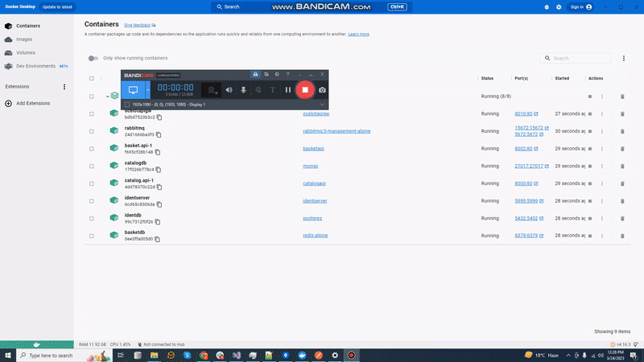

# HiTech-Microservices
# Run The Project

You need signing certificate which will be required for launching Microservices:
Run ".\HiTech-Microservices\src\Extra\MIscConsole\MIscConsole.csproj"


Signing certificate is added to each Microservice.


For Containerization.
You will need the following tools:
* Docker
## Installing
Follow these steps to get your deployemnet environment set up: (Before Run Start the Docker Desktop)
1. Clone the repository
2. Once Docker for Windows is installed, go to the Settings > Advanced option, from the Docker icon in the system tray, to configure the minimum amount of memory and CPU like so:
* Memory: 4 GB minimum
* CPU: 2 miniumum
3. At the root directory which include docker-compose.yml files, run below command from cmd/teriminal:
```
docker-compose -f docker-compose.yml -f docker-compose.override.yml up -d
```
>Note: If you get connection timeout error Docker for Mac please [Turn Off Docker's "Experimental Features".](https://thenewstack.io/how-to-enable-docker-experimental-features-and-encrypt-your-login-credentials/)

4. Wait for docker compose all microservices. That’s it! (some microservices need extra time to work so please wait if not worked in first shut)

5. You can launch microservices with swagger as below urls:
* **API Gateway -> http://localhost:8010/swagger/index.html**
# Result 
- Issue 8

6. If you want to udapte microservices application you will need to shutdown all docker containers first
```
docker-compose -f docker-compose.yml -f docker-compose.override.yml down
```
7. Build the docker images again
```
docker-compose -f docker-compose.yml -f docker-compose.override.yml build
```
8. Finally up again 
```
docker-compose -f docker-compose.yml -f docker-compose.override.yml up -d
```


